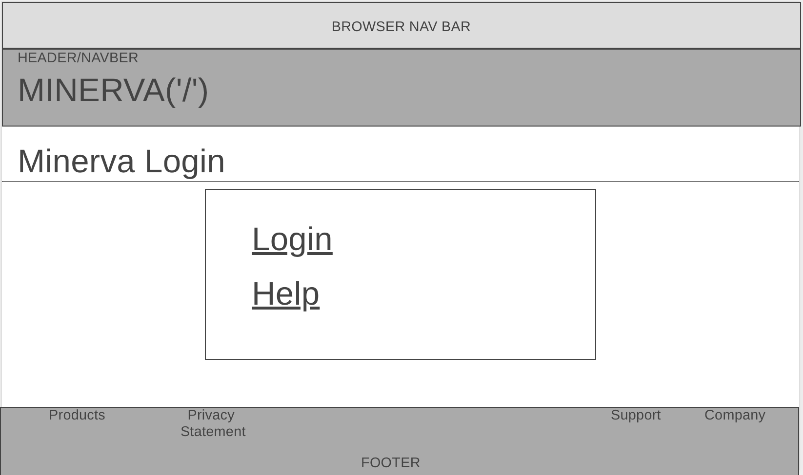
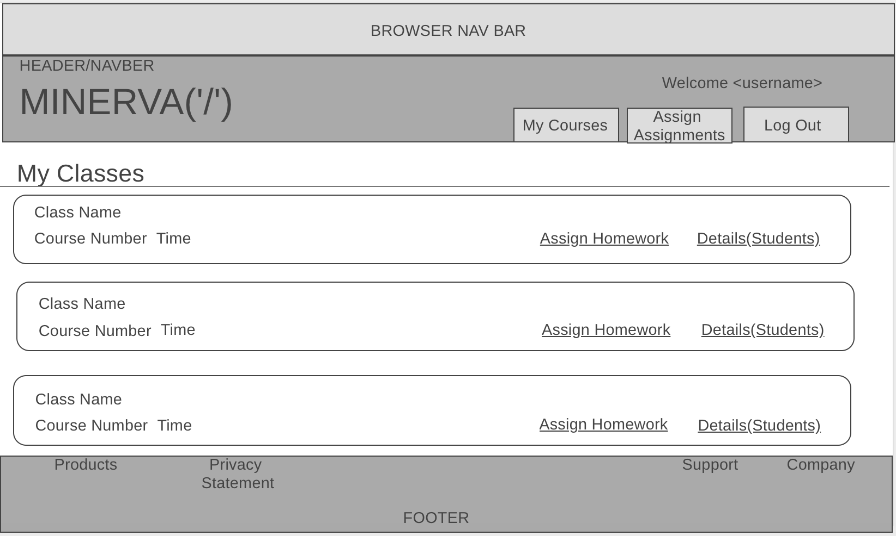
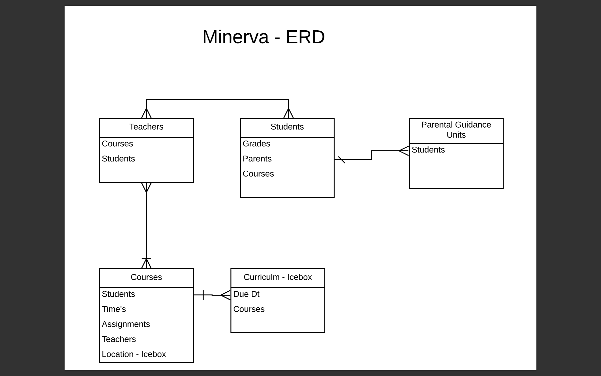

# Minerva
## "It takes a village to educate a child"
Minerva is an app which allows teachers to virtually keep track of their homework assignments and student completion. No more worrying about losing paper copies! 

## Planning

## Technologies Used: 
* CSS
* HTML
* Bootstrap
* Python
* Django
* Postgresql

## Getting Started
[App Link](http://minervapp.herokuapp.com/)

### Instructions:
1) Log in using your google ID
2) Add students to your class
3) Add homework assignments 
4) Assign students to the homework

## Next Steps and Future Enhancements 
In the future the app will be scaled up to include different user models including student and parent so that everyone involved in the education process will be able to make sure they are on the same page. 